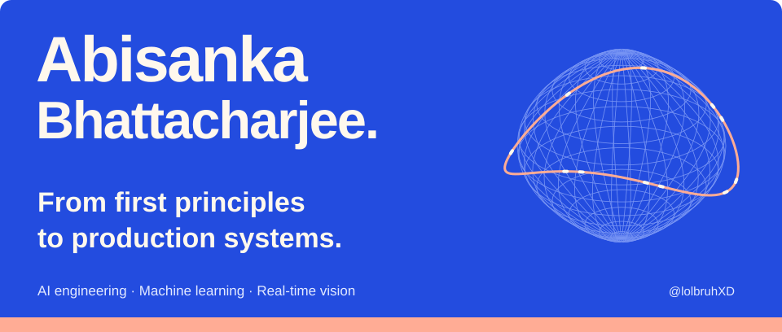
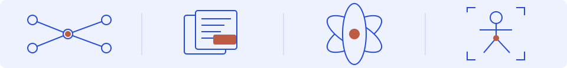
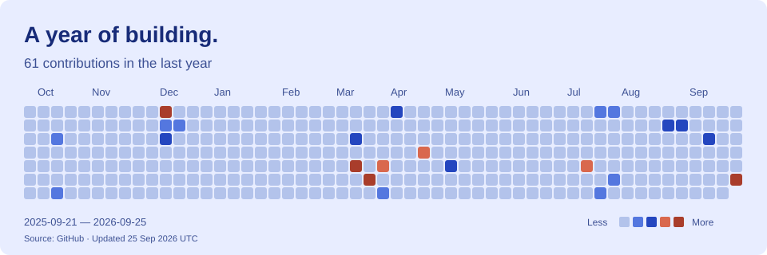

<!-- Profile content is maintained by Abisanka. Artwork is local; activity is refreshed by GitHub Actions. -->
<picture>
  <source media="(max-width: 600px)" srcset="assets/hero-mobile.svg">
  
</picture>

  <a href="https://www.linkedin.com/in/abisanka-bhattacharjee/">LinkedIn</a> &nbsp; · &nbsp;
  <a href="mailto:bhattacharjeeabisanka@gmail.com">Email me</a> &nbsp; · &nbsp;
  <a href="#selected-work">Explore my work</a>

I'm **Abisanka**, an engineer working across **AI agents, machine learning, and real-time vision**. I like understanding the machinery underneath a model, then building the systems that make it useful.

My work spans agent memory and evaluation at **Lythe**, live-video virtual try-on at **AROH**, and biologically inspired computation at **NeuroNex Labs**. Alongside that, I'm pursuing a **B.Tech in Computer Science & Engineering at Lovely Professional University**, expected May 2029.

## What I'm building

**AROH · Founding Engineer**  
*September 2026–present*  
End-to-end product engineering and a monocular-depth virtual try-on pipeline: depth inference, body segmentation, garment warping, and compositing for live video. Built for **1080p at 24 FPS**.

**Lythe / LytheLabs · Forward Deployed Engineer, Founding Team**  
*January 2026–present*  
Agent evaluation, observability, and infrastructure. Built and maintained **ToonDB**, a Go document database for agent memory, with durable storage and JavaScript/Python SDKs. Co-developed **Fraser**, an AI-agent QA product, and worked on multi-agent orchestration, mobile testing, Telegram agents, and streaming voice.

**NeuroNex Labs · Co-Founder**  
*2025–present*  
Exploring spiking neural networks, Hodgkin–Huxley neuron models, and spike-timing-dependent plasticity, with an interest in neuromorphic hardware.

Previously: **Member of Technical Staff Intern at Wuri (YC W24)**, February–July 2025, working on CI/CD and deployment automation. Completed **Y Combinator Startup School** in 2024.

## Selected work

### [Autograd from scratch](https://github.com/lolbruhXD/Creating-AutoGrad-from-scratch)
**Understand the gradient.** A learning implementation inspired by Andrej Karpathy's micrograd: scalar operations, computation graphs, backward functions, and Graphviz visualizations. An exploration of what an autodiff engine does under the hood.

`Python` `Automatic differentiation` `Graphviz`

### [OpenOrbit](https://github.com/lolbruhXD/OpenOrbit)
**Give unfinished ideas a place to meet.** A developer project-sharing platform built for the IIITM Gwalior hackathon, with a mobile feed, real-time conversations, and an integrated AI code helper.

`TypeScript` `React Native / Expo` `Node.js` `MongoDB` `Socket.io`

### [Holo-Vex](https://github.com/lolbruhXD/holo-vex)
**Turn hand movements into visual interaction.** A webcam-based holographic-effects experiment with hand tracking, pinch controls, two-hand scaling and rotation, and particle effects. Includes a synthetic input mode for experimenting without a camera.

`Python` `OpenCV` `MediaPipe` `NumPy`

### [FacPosCheck](https://github.com/lolbruhXD/FacPosCheck)
**Explore vision in real time.** An experimental video-analysis pipeline combining face tracking and recognition with human pose estimation and background processing.

`Python` `OpenCV` `DeepFace` `MediaPipe`

<b>More experiments: language models, matching, and embedded sensing</b>

 

- **Novella** — a small, from-scratch Mixture-of-Experts title generator with genre-specific experts, top-k routing, and a load-balancing loss. Built with Python, PyTorch, and NumPy.
- **ML fundamentals** — backpropagation, multilayer perceptrons, GPT-style transformers, and QLoRA fine-tuning experiments.
- **Skye** — a Telegram-native matching engine combining HNSW vector search with LLM re-ranking.
- **Vasc-AI** — an ESP32-based prototype for streaming and processing PPG sensor signals.

These are additional projects from my engineering work; public source links are not currently listed here.

## Tools I work with

| Area | Toolkit |
| :--- | :--- |
| **Models & math** | Python · PyTorch · NumPy · CUDA |
| **Agents & retrieval** | LangChain · LangGraph · HNSW · streaming STT/TTS |
| **Systems & APIs** | Go · TypeScript / JavaScript · Node.js · FastAPI · SQL |
| **Vision & hardware** | OpenCV · MediaPipe · C / C++ · ESP32 |
| **Shipping** | Docker · AWS · Git · CI/CD |

## Building in the open

<picture>
  <source media="(max-width: 600px) and (prefers-color-scheme: dark)" srcset="assets/activity-mobile-dark.svg">
  <source media="(max-width: 600px)" srcset="assets/activity-mobile-light.svg">
  <source media="(prefers-color-scheme: dark)" srcset="assets/activity-dark.svg">
  
</picture>

Activity updates weekly from GitHub. It reflects GitHub contributions, not all of my engineering work.

## Let's build something worth understanding.

I'm interested in conversations about **agent reliability, efficient model architectures, neuromorphic computing, and real-time AI**.

**[Get in touch](mailto:bhattacharjeeabisanka@gmail.com)** · [Connect on LinkedIn](https://www.linkedin.com/in/abisanka-bhattacharjee/)

