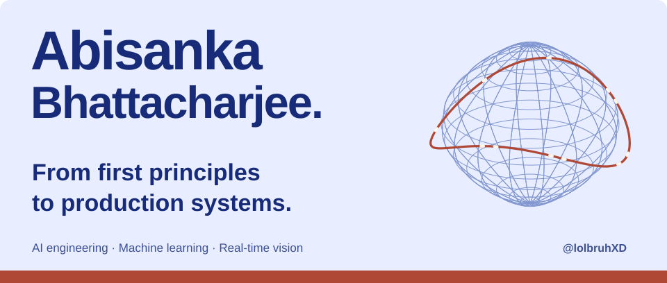
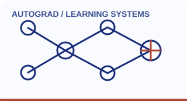
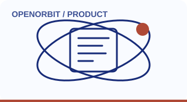
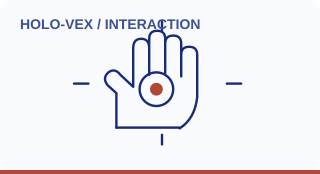
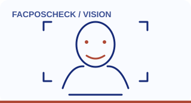
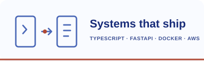
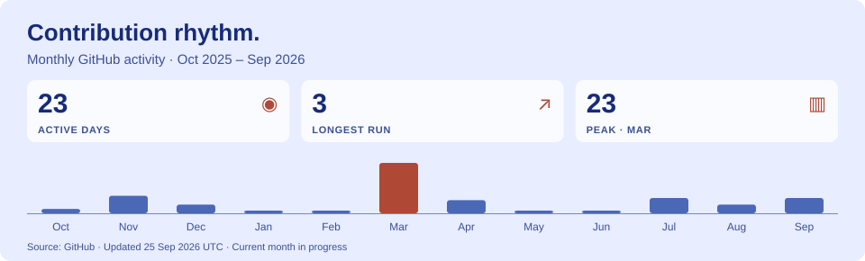
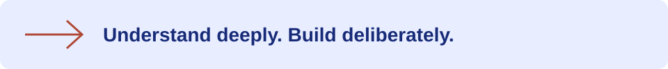

<!-- Profile content is maintained by Abisanka. Illustrations follow GitHub's light/dark theme. -->
<a href="#selected-work" aria-label="Explore Abisanka's selected projects">
  <picture>
    <source media="(max-width: 600px) and (prefers-color-scheme: dark)" srcset="assets/hero-mobile-dark.svg">
    <source media="(max-width: 600px)" srcset="assets/hero-mobile-light.svg">
    <source media="(prefers-color-scheme: dark)" srcset="assets/hero-dark.svg">
    
  </picture>
</a>

  <a href="https://www.linkedin.com/in/abisanka-bhattacharjee/">LinkedIn</a> &nbsp; · &nbsp;
  <a href="mailto:bhattacharjeeabisanka@gmail.com">Email me</a> &nbsp; · &nbsp;
  <a href="#selected-work">Explore my work</a>

I'm **Abisanka**, an engineer working across **AI agents, machine learning, and real-time vision**. I like understanding the machinery underneath a model, then building the systems that make it useful.

My work spans agent memory and evaluation at **Lythe**, biologically inspired computation at **NeuroNex Labs**, and experiments that make machine learning easier to understand from the inside out.

## What I'm building

**Lythe / LytheLabs · Forward Deployed Engineer, Founding Team**  
*January 2026–present*  
Agent evaluation, observability, and infrastructure. Built and maintained **ToonDB**, a Go document database for agent memory, with durable storage and JavaScript/Python SDKs. Co-developed **Fraser**, an AI-agent QA product, and worked on multi-agent orchestration, mobile testing, Telegram agents, and streaming voice.

**NeuroNex Labs · Co-Founder**  
*2025–present*  
Exploring spiking neural networks, Hodgkin–Huxley neuron models, and spike-timing-dependent plasticity, with an interest in neuromorphic hardware.

Previously: **Member of Technical Staff Intern at Wuri (YC W24)**, February–July 2025, working on CI/CD and deployment automation. Completed **Y Combinator Startup School** in 2024.

## Selected work

Click an illustration to explore its repository. Each project also has a short explanation below.

<table width="100%">
  <tr>
    <td width="50%" align="center"><a href="https://github.com/lolbruhXD/Creating-AutoGrad-from-scratch"><picture><source media="(prefers-color-scheme: dark)" srcset="assets/project-autograd-dark.svg"></picture> <strong>Autograd from scratch ↗</strong></a></td>
    <td width="50%" align="center"><a href="https://github.com/lolbruhXD/OpenOrbit"><picture><source media="(prefers-color-scheme: dark)" srcset="assets/project-orbit-dark.svg"></picture> <strong>OpenOrbit ↗</strong></a></td>
  </tr>
  <tr>
    <td width="50%" align="center"><a href="https://github.com/lolbruhXD/holo-vex"><picture><source media="(prefers-color-scheme: dark)" srcset="assets/project-holo-dark.svg"></picture> <strong>Holo-Vex ↗</strong></a></td>
    <td width="50%" align="center"><a href="https://github.com/lolbruhXD/FacPosCheck"><picture><source media="(prefers-color-scheme: dark)" srcset="assets/project-vision-dark.svg"></picture> <strong>FacPosCheck ↗</strong></a></td>
  </tr>
</table>

### [Autograd from scratch](https://github.com/lolbruhXD/Creating-AutoGrad-from-scratch)
**Understand the gradient.** A learning implementation inspired by Andrej Karpathy's micrograd: scalar operations, computation graphs, backward functions, and Graphviz visualizations. An exploration of what an autodiff engine does under the hood.

`Python` `Automatic differentiation` `Graphviz`

### [OpenOrbit](https://github.com/lolbruhXD/OpenOrbit)
**Give unfinished ideas a place to meet.** A developer project-sharing platform built for the IIITM Gwalior hackathon, with a mobile feed, real-time conversations, and an integrated AI code helper.

`TypeScript` `React Native / Expo` `Node.js` `MongoDB` `Socket.io`

### [Holo-Vex](https://github.com/lolbruhXD/holo-vex)
**Turn hand movements into visual interaction.** A webcam-based holographic-effects experiment with hand tracking, pinch controls, two-hand scaling and rotation, and particle effects. Includes a synthetic input mode for experimenting without a camera.

`Python` `OpenCV` `MediaPipe` `NumPy`

### [FacPosCheck](https://github.com/lolbruhXD/FacPosCheck)
**Explore vision in real time.** An experimental video-analysis pipeline combining face tracking and recognition with human pose estimation and background processing.

`Python` `OpenCV` `DeepFace` `MediaPipe`

<b>More experiments: language models, matching, and embedded sensing</b>

 

- **Novella** — a small, from-scratch Mixture-of-Experts title generator with genre-specific experts, top-k routing, and a load-balancing loss. Built with Python, PyTorch, and NumPy.
- **ML fundamentals** — backpropagation, multilayer perceptrons, GPT-style transformers, and QLoRA fine-tuning experiments.
- **Skye** — a Telegram-native matching engine combining HNSW vector search with LLM re-ranking.
- **Vasc-AI** — an ESP32-based prototype for streaming and processing PPG sensor signals.

These are additional projects from my engineering work; public source links are not currently listed here.

## The toolkit behind the work

Four connected parts of my practice. Each card opens a project or the work it supports.

<table width="100%">
  <tr>
    <td width="50%" valign="top"><a href="https://github.com/lolbruhXD/Creating-AutoGrad-from-scratch"><picture><source media="(prefers-color-scheme: dark)" srcset="assets/stack-models-dark.svg"></picture></a> From gradients and tensors to models I can explain. <a href="https://github.com/lolbruhXD/Creating-AutoGrad-from-scratch">Explore Autograd ↗</a></td>
    <td width="50%" valign="top"><a href="#what-im-building"><picture><source media="(prefers-color-scheme: dark)" srcset="assets/stack-agents-dark.svg"></picture></a> Memory, retrieval, evaluation, and streaming voice. <a href="#what-im-building">See current work ↗</a></td>
  </tr>
  <tr>
    <td width="50%" valign="top"><a href="https://github.com/lolbruhXD/holo-vex"><picture><source media="(prefers-color-scheme: dark)" srcset="assets/stack-vision-dark.svg"></picture></a> Hands, faces, pose, and sensor signals in motion. <a href="https://github.com/lolbruhXD/holo-vex">Explore Holo-Vex ↗</a></td>
    <td width="50%" valign="top"><a href="https://github.com/lolbruhXD/OpenOrbit"><picture><source media="(prefers-color-scheme: dark)" srcset="assets/stack-systems-dark.svg"></picture></a> APIs, product surfaces, deployment, and the glue between them. <a href="https://github.com/lolbruhXD/OpenOrbit">Explore OpenOrbit ↗</a></td>
  </tr>
</table>

Also in the toolbox: JavaScript, Node.js, SQL, LangChain, streaming STT/TTS, C/C++, Git, and CI/CD.

## Building in the open

<a href="https://github.com/lolbruhXD?tab=overview" aria-label="Open Abisanka's GitHub contribution calendar and inspect individual days">
  <picture>
    <source media="(max-width: 600px) and (prefers-color-scheme: dark)" srcset="assets/activity-mobile-dark.svg">
    <source media="(max-width: 600px)" srcset="assets/activity-mobile-light.svg">
    <source media="(prefers-color-scheme: dark)" srcset="assets/activity-dark.svg">
    
  </picture>
</a>

Click the chart for GitHub's interactive contribution history. This image updates weekly and reflects GitHub contributions, not all of my engineering work.

<a href="https://github.com/lolbruhXD?tab=overview" aria-label="Open Abisanka's GitHub contributions to inspect the monthly activity behind this chart">
  <picture>
    <source media="(max-width: 600px) and (prefers-color-scheme: dark)" srcset="assets/momentum-mobile-dark.svg">
    <source media="(max-width: 600px)" srcset="assets/momentum-mobile-light.svg">
    <source media="(prefers-color-scheme: dark)" srcset="assets/momentum-dark.svg">
    
  </picture>
</a>

The second view shows active days and the longest run across the returned year, plus monthly bars for the latest 12 calendar months. The current month is still in progress; everything updates weekly.

## Let's build something worth understanding.

I'm interested in conversations about **agent reliability, efficient model architectures, neuromorphic computing, and real-time AI**.

**[Get in touch](mailto:bhattacharjeeabisanka@gmail.com)** · [Connect on LinkedIn](https://www.linkedin.com/in/abisanka-bhattacharjee/)

<a href="mailto:bhattacharjeeabisanka@gmail.com" aria-label="Email Abisanka Bhattacharjee"><picture><source media="(prefers-color-scheme: dark)" srcset="assets/footer-dark.svg"></picture></a>
